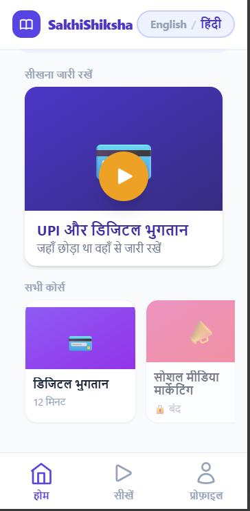

# SakhiShiksha - Digital Literacy Platform

Mobile-first learning platform for Indian women entrepreneurs with bilingual education (English & हिंदी), AI tutoring, and interactive assessments.

---

## 📱 Application Screens & Features

### **Screen 1: Home Dashboard**


**Visual Components**:
- SakhiShiksha logo with language toggle pill
- "Resume Learning" featured card (UPI & Digital Payments)
- "All Courses" carousel with module cards
- Bottom navigation (Home, Learn, Profile)

**Functionality**:
- Users see their last accessed module for quick resume
- Browse available courses with locked/unlocked status
- Switch between 4 key app views
- Progress indicator on completed courses

**User Value**: Reduces friction to learning—one tap resumes interrupted lessons.

---

### **Screen 2: Module Introduction**

**Visual Components**:
- Hero card with gradient background and module emoji (💳)
- "What you will learn" section with bullet points
- Module duration and difficulty badge ("12 min • Beginner")
- Module progress bar showing slides and questions
- Large "Start Module" button

**Functionality**:
- Displays learning objectives before starting
- Sets time expectation
- Shows completion status if already attempted
- Navigate back to home

**User Value**: Clarifies what to expect, increasing completion likelihood.

---

### **Screen 3: Video & Learning Module**

**Visual Components**:
- Full-width video player ("The Wealth Shield" example)
- Two tabs: "Lecture Notes" and "AI से पूछें" (Ask AI)
- Hindi lecture notes with paragraphs and key points
- Floating "Read Aloud" button (speaker icon)
- Back and Continue navigation buttons

**Functionality**:
- Play/pause/seek/fullscreen controls
- Switch between video and text notes
- Text-to-speech for accessibility
- Contextual AI Q&A support in second tab
- Bilingual content (English/Hindi)

**User Value**: Multi-modal learning accommodates different styles; accessibility features level the playing field.

---

### **Screen 4: AI Tutor - Interactive Q&A**

**Visual Components**:
- WhatsApp-style chat interface
- Tabs: "लेक्चर नोट्स" and "AI से पूछें"
- User message (gray bubble, right): *"iss video me kya bataya jaa raha hai?"* (What was told in this video?)
- AI response (blue bubble, left): Hindi explanation of UPI, virtual ID, and security
- Text input with Hindi placeholder, orange send button

**AI Logic**:
- Auto-detects API key format in `.env`:
  - `sk-...` → routes to OpenAI (gpt-4o-mini)
  - `AIza...` → routes to Google Gemini (gemini-2.5-flash-lite)
- System prompt constrains answers to:
  - Current lesson context only
  - User's language (English or Hindi)
  - 2–3 sentences for brevity
  - Tutoring tone for first-time learners

**Functionality**:
- Instant response to learner questions
- Shows typing indicator while processing
- Maintains conversation history within session
- Error handling with fallback messages

**User Value**: Removes learning barriers by answering doubts on-demand without leaving the lesson.

---

### **Screen 5: Learning Dashboard**

**Visual Components**:
- Header: "लर्निंग डैशबोर्ड" (Learning Dashboard)
- Live indicator: "4,210 उपयोगकर्ता अभी ऑनलाइन हैं" (users online)
- 2×2 metric cards grid:
  - **महिलाएं पंजीकृत** (Women Enrolled): 12,480 (83%)
  - **मॉड्यूल पूर्ण** (Modules Completed): 8,942 (71%)
  - **इस सप्ताह सक्रिय** (Active This Week): 4,210 (57%)
  - **औसत क्विज़ पास %**: 87%
- Weekly activity bar chart with 7 days (M–S) and gradient coloring

**Metrics Shown**:
- Enrollment growth
- Completion rate
- Weekly engagement
- Assessment success rate

**User Value**: Transparency builds trust; social proof motivates continued engagement.

---

## 🛠️ Technology Stack

| Layer | Tools |
|-------|-------|
| **Frontend** | React 18.3.1 |
| **Build Tool** | Vite 5.4.10 |
| **Styling** | Tailwind CSS 3.4.14 + PostCSS |
| **State Management** | React Context API |
| **Persistence** | Browser localStorage |
| **AI APIs** | OpenAI + Google Gemini |

---

## ✨ Core Features

✅ **Bilingual Interface** – Toggle between English & हिंदी  
✅ **AI Tutor** – Contextual Q&A within lessons  
✅ **Video Lessons** – Engaging multimedia content  
✅ **Interactive Quizzes** – Knowledge verification with feedback  
✅ **Progress Tracking** – Track completion & scores locally  
✅ **Text-to-Speech** – Read-aloud for accessibility  
✅ **Offline Support** – Learn without internet (cached content)  

---

## 🚀 Getting Started

```bash
# Install dependencies
npm install

# Copy environment template
cp .env.example .env

# Add API key (OpenAI or Gemini)
# VITE_API_KEY=sk-... (OpenAI)
# VITE_API_KEY=AIza... (Google Gemini)

# Start dev server
npm run dev
# Open http://localhost:5173